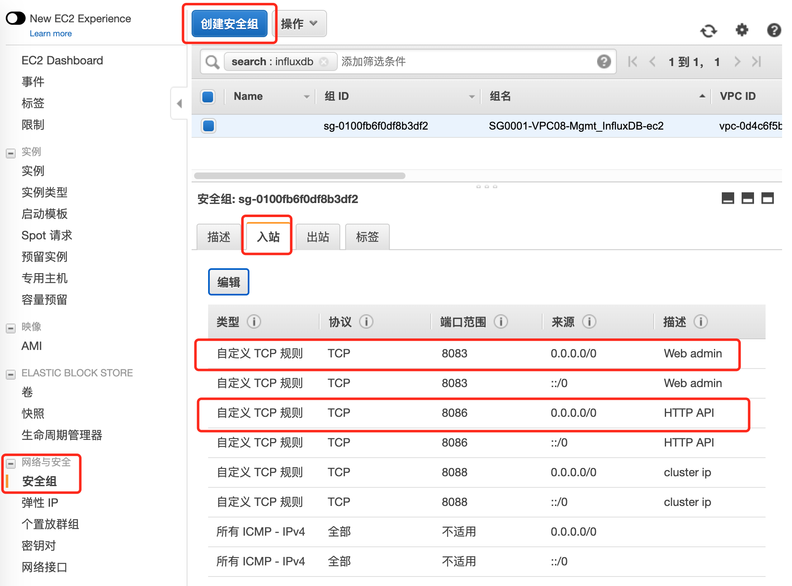

# AWS教程-在Amazon Linux 2 AMI上安装部署InfluxDB

## 一、简介

InfluxDB 是使用 GO
编写的基于时间序列的数据库，用于存储大量带有时间戳的数据，报错 DevOps
监控，日志数据，应用程序的指标、数据分析数据等等。通过 InfluxDB
自动保存数据，你不需要删除和清理，只需要定义一段时间 DB 会帮你自动清理。

**1、InfluxDB 提供三种操作方式：**

-   客户端命令行方式

-   HTTP API 接口

-   各语言 API 库

**2、基本概念**

InfluxDB 与传统数据库（如：MySQL）的一些区别，以及对应理解：

    InfluxDB | 传统数据库中的概念
    database | 数据库
    measurement | 数据库中的表
    points | 表里面的一行数据

**3、特有概念**

1.  tag--标签，在 InfluxDB 中，tag 是一个非常重要的部分，表名+tag
    一起作为数据库的索引，是"key-value"的形式

2.  field--数据，field 主要是用来存放数据的部分，也是"key-value"的形式

3.  timestamp--时间戳，作为时序型数据库，时间戳是 InfluxDB
    中最重要的部分，在插入数据时可以自己指定也可留空让系统指定
    （**说明**：*在插入新数据时，tag、field 和 timestamp
    之间用空格分隔）*

4.  series--序列，所有在数据库中的数据，都需要通过图表来展示，而这个
    series
    表示这个表里面的数据，可以在图表上画成几条线。具体可以通过 SHOW
    SERIES FROM \"表名\" 进行查询

5.  Retention
    policy--数据保留策略，可以定义数据保留的时长，每个数据库可以有多个数据保留策略，但只能有一个默认策略

6.  Point--点，表示每个表里某个时刻的某个条件下的一个 field
    的数据，因为体现在图表上就是一个点，于是将其称为 point。

    | 项目        | 描述  |  
    | --------   | -------  | 
    | Point 属性 | 传统数据库中的概念 | 
    | time | 每个数据记录时间，是数据库中的主索引 (会自动生成) | 
    | fields | 表中的列（没有索引的属性）也就是记录的值：温度， 湿度 | 
    | tags | 表中的索引：地区，海拔 | 

**4. 端口服务**

-   8083：Web admin
    管理服务的端口, [http://localhost:8083](http://localhost:8083/)

-   8086：HTTP API 的端口

-   8088：集群端口 (单机版用不到)

## 二、安装并启动

**1. 基于 Amazon Linux 2 AMI上安装部署InfluxDB**

    wget
    https://dl.influxdata.com/influxdb/releases/influxdb-1.8.2.x86\_64.rpm
    sudo yum localinstall influxdb-0.13.0.x86\_64.rpm

全部版本的InfluxDB安装包，请参考这里：https://repos.influxdata.com/centos/8/x86\_64/stable/

**2、启动**

    # start and enable influxdb
    sudo systemctl start influxdb
    sudo systemctl enable influxdb
    sudo systemctl status influxdb

## 三、客户端命令操作（基本语法）

    # 通过 influx 命令进入 cli 命令行
    influx
    Connected to http://localhost:8086 version 1.4.2
    InfluxDB shell version: 1.4.2

    \>

    # 查看用户
    SHOW USERS

    # 创建用户
    CREATE USER influx WITH PASSWORD \'influx\' WITH ALL PRIVILEGES

    # 查看用户
    SHOW USERS

    # 创建数据库
    CREATE DATABASE test

    # 查看数据库
    SHOW DATABASES

    # Using 数据库
    USE test

    # 插入数据
    INSERT cpu,host=192.168.1.1 load=0.1,usage=0.2

    # 查询所有数据
    SELECT \* FROM \"cpu\"
    SELECT \"host\",\"load\",\"usage\" FROM \"cpu\"

    # 根据条件查询
    SELECT \"host\",\"load\",\"usage\" FROM \"cpu\" WHERE \"host\" =
    \'192.168.1.1\'
    SELECT \"host\",\"load\",\"usage\" FROM \"cpu\" WHERE \"usage\" \> 0.1

    # 创建数据库
    CREATE DATABASE \"db\_name\"

    # 显示所有数据库
    SHOW DATABASES

    # 删除数据库
    DROP DATABASE \"db\_name\"

    # 使用数据库
    USE mydb

    # 显示该数据库中的表
    SHOW MEASUREMENTS

    # 删除表
    DROP MEASUREMENT \"t\_name\"

    # 简单查询
    SELECT \* FROM codis\_usage ORDER BY time DESC LIMIT 3

    # 最近 60min 内的数据
    SELECT \* FROM codis\_usage WHERE time \>= now() - 60m;

    # 获取最近更新数据，并转换为当前时间
    precision rfc3339
    select \* from codis\_usage order by time desc limit 10;

    # 查询保存策略
    show retention policies on codis

    # 创建新的 Retention Policies 并设置为默认值
    # duration 保留多少天
    # replication 副本数
    create retention policy \"rp\_14d\" ON \"codis\" duration 14d
    replication 1 default

    # 恢复默认策略（永久保存）
    alter retention policy \"autogen\" on \"codis\" duration 0s replication
    1 default

    # 创建数据库 API
    curl -i -XPOST http://localhost:8086/query \--data-urlencode \"q=CREATE
    DATABASE test\"

    # 写入数据 API
    # 写入单条
    curl -i -XPOST http://localhost:8086/write?db=test \--data-binary
    \"cpu,host=192.168.1.3 load=0.1,usage=0.33\"
    curl -i -XPOST http://localhost:8086/write?db=test \--data-binary
    \"cpu,host=192.168.1.3 load=0.1,usage=0.33 6666666666666666666\"

    # 写入多条
    curl -i -XPOST http://localhost:8086/write?db=test \--data-binary
    \"cpu,host=192.168.1.2 load=0.1,usage=0.22 1666666666666666661
    cpu,host=192.168.1.3 load=0.1,usage=0.33 1666666666666666661
    cpu,host=192.168.1.2 load=0.2,usage=0.22 1666666666666666662
    cpu,host=192.168.1.3 load=0.2,usage=0.33 1666666666666666662\"

    # 查询数据 API
    curl -G http://localhost:8086/query?db=test \--data-urlencode \"q=SELECT
    \* FROM \\\"cpu\\\"\"

## 四、可视化客户端安装与访问

Windows客户端为绿色版，下载解压打开即可。下载地址：[Releases ·
CymaticLabs/InfluxDBStudio](https://github.com/CymaticLabs/InfluxDBStudio/releases)

这里也提供 InfluxDB Studio 的使用说明，供大家参考：[windows 下 influxDB
操作工具
InfluxDBStudio](https://cloud.tencent.com/developer/article/1444098)

1、开启EC2的 8086 HTTP API 等端口，远程客户端可以访问

## 五、备份恢复

只支持全量备份，不支持增量，包括了元数据以及增量数据的备份，可以参考
官方文档https://docs.influxdata.com/influxdb/v1.7/administration/backup\_and\_restore/

    # 元数据备份
    influxd backup \<path-to-backup\>

    # 数据备份
    influxd backup -database \<mydatabase\> \<path-to-backup\>
    influxd backup -database telegraf -retention autogen -since
    2016-02-01T00:00:00Z /tmp/backup

    influxd backup -database mydatabase -host 10.0.0.1:8088
    /tmp/remote-backup

    # 恢复
    influxd restore -metadir /var/lib/influxdb/meta /tmp/backup
    influxd restore -database telegraf -datadir /var/lib/influxdb/data
    /tmp/backup

